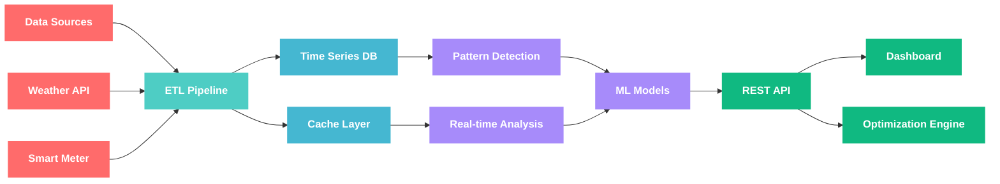
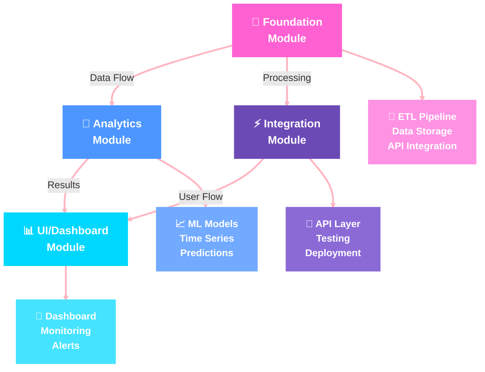
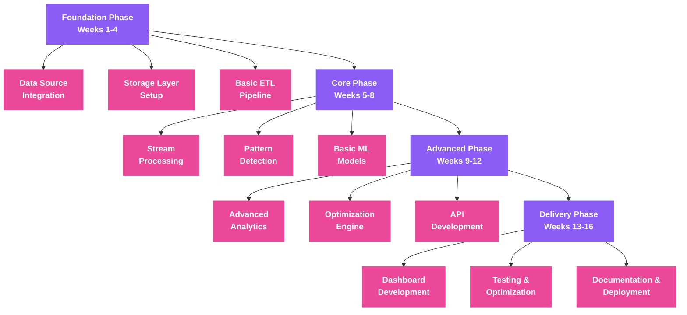
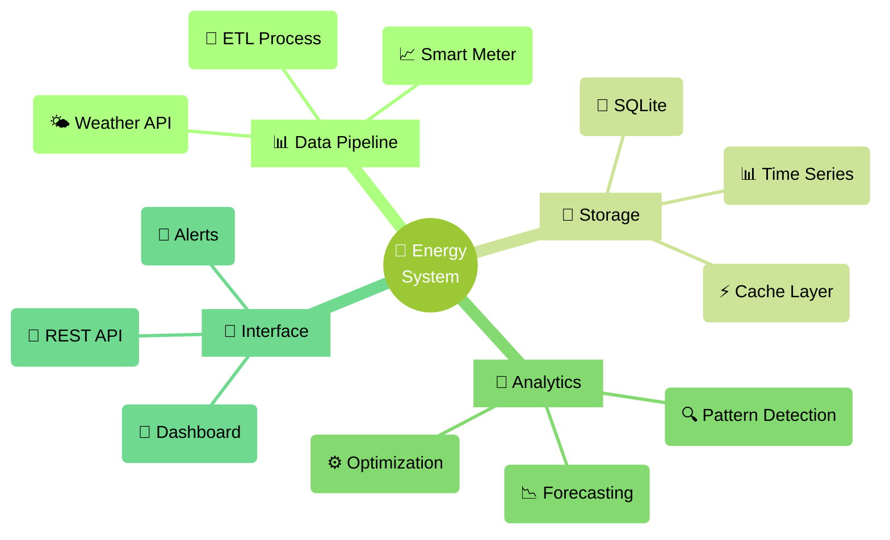

# Smart Home Energy Optimization System

An end-to-end data engineering pipeline for optimizing home energy consumption through real-time monitoring, analysis, and ML-powered recommendations.

## System Architecture




## Implementation Roadmap




## Development Phases




## Technical Stack




## Project Structure
```
energy-optimization/
├── src/
│   ├── generate_mermaid_diagrams.py    # Handles both README and diagram integration
│   ├── generate_dashboard.py           # Handles main dashboard UI docs/index.html
│   ├── data_collection/
│   │   ├── weather_api.py
│   │   └── smart_meter.py
│   ├── processing/
│   │   ├── etl_pipeline.py
│   │   └── event_stream.py
│   ├── analysis/
│   │   ├── pattern_detection.py
│   │   └── ml_models.py
│   └── api/
│       ├── routes.py
│       └── optimization.py
├── docs/
│   └── index.html                      # Project Results Dashboard
└── README.md                           # Project Documentation
```

## Project Features
- Real-time energy consumption monitoring
- Weather data integration and correlation
- ML-powered usage pattern detection
- Automated optimization recommendations
- Interactive visualization dashboard

## Technical Stack
- Data Collection: Python, Weather API, Smart Meter Integration
- Storage: SQLite, Time Series Database
- Analysis: Pattern Detection, ML Models
- Interface: REST API, Web Dashboard

## Local Development
```bash
# Generate root README and dashboard
python generate_docs.py
python -m http.server --directory docs
```

## Project Results
View the working project and results at: [Project Dashboard](https://ngnnah.github.io/energy-optimization/)
