# Smart Home Energy Optimization System

An end-to-end data engineering pipeline for optimizing home energy consumption through real-time monitoring, analysis, and ML-powered recommendations.

## System Architecture


## Implementation Roadmap

```mermaid
graph TD
    classDef phase fill:#FF6B6B,stroke:#FF6B6B,stroke-width:4px,color:white,font-weight:bold,font-size:18px
    classDef module fill:#4ECDC4,stroke:#4ECDC4,stroke-width:4px,color:white,font-weight:bold,font-size:16px

    %% Top Row - Scale nodes with more content
    F[🚀 Foundation<br/>Module]:::phase --> |Data Flow| A[🧠 Analytics<br/>Module]:::phase
    
    %% Bottom Row
    I[⚡ Integration<br/>Module]:::phase --> |User Flow| U[📊 UI/Dashboard<br/>Module]:::phase
    
    %% Vertical Connections with descriptive labels
    F --> |Processing| I
    A --> |Results| U
    
    %% Components in each module with emojis and detailed text
    F --> F1[🔄 ETL Pipeline<br/>Data Storage<br/>API Integration]:::module
    A --> A1[📈 ML Models<br/>Time Series<br/>Predictions]:::module
    I --> I1[🔌 API Layer<br/>Testing<br/>Deployment]:::module
    U --> U1[💫 Dashboard<br/>Monitoring<br/>Alerts]:::module

    %% Style overrides for better visibility
    style F fill:#FF61D2,stroke:#FF61D2,color:#fff
    style A fill:#4D96FF,stroke:#4D96FF,color:#fff
    style I fill:#6C4AB6,stroke:#6C4AB6,color:#fff
    style U fill:#00D7FF,stroke:#00D7FF,color:#fff
    
    %% Module styling
    style F1 fill:#FF92E3,stroke:#FF92E3,color:#fff
    style A1 fill:#72AAFF,stroke:#72AAFF,color:#fff
    style I1 fill:#8B6AD6,stroke:#8B6AD6,color:#fff
    style U1 fill:#45E3FF,stroke:#45E3FF,color:#fff

    %% Link styling
    linkStyle 0,1,2,3,4,5,6,7 stroke-width:3px,fill:none,stroke:#FFB6C1
```




## Development Phases


## Technical Stack




```mermaid
%%{init: {'theme':'forest'}}%%
mindmap
    root((🔋 Energy<br/>System))
        [📊 Data Pipeline]
            (🌤️ Weather API)
            (📈 Smart Meter)
            (🔄 ETL Process)
        [💾 Storage]
            (📀 SQLite)
            (📊 Time Series)
            (⚡ Cache Layer)
        [🧠 Analytics]
            (🔍 Pattern Detection)
            (📉 Forecasting)
            (⚙️ Optimization)
        [🎯 Interface]
            (🔌 REST API)
            (📱 Dashboard)
            (🔔 Alerts)
```

## Project Structure
```
energy-optimization/
├── src/
│   ├── generate_mermaid_diagrams.py    # Handles both README and diagram integration
│   ├── generate_dashboard.py           # Handles main dashboard UI docs/index.html
│   ├── data_collection/
│   │   ├── weather_api.py
│   │   └── smart_meter.py
│   ├── processing/
│   │   ├── etl_pipeline.py
│   │   └── event_stream.py
│   ├── analysis/
│   │   ├── pattern_detection.py
│   │   └── ml_models.py
│   └── api/
│       ├── routes.py
│       └── optimization.py
├── docs/
│   └── index.html                      # Project Results Dashboard
└── README.md                           # Project Documentation
```

## Project Features
- Real-time energy consumption monitoring
- Weather data integration and correlation
- ML-powered usage pattern detection
- Automated optimization recommendations
- Interactive visualization dashboard

## Technical Stack
- Data Collection: Python, Weather API, Smart Meter Integration
- Storage: SQLite, Time Series Database
- Analysis: Pattern Detection, ML Models
- Interface: REST API, Web Dashboard

## Local Development
```bash
# Generate root README and dashboard
python generate_docs.py
python -m http.server --directory docs
```

## Project Results
View the working project and results at: [Project Dashboard](https://ngnnah.github.io/energy-optimization/)
